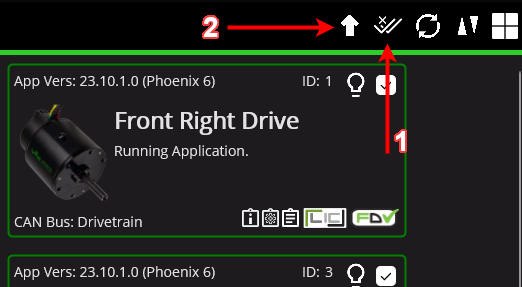
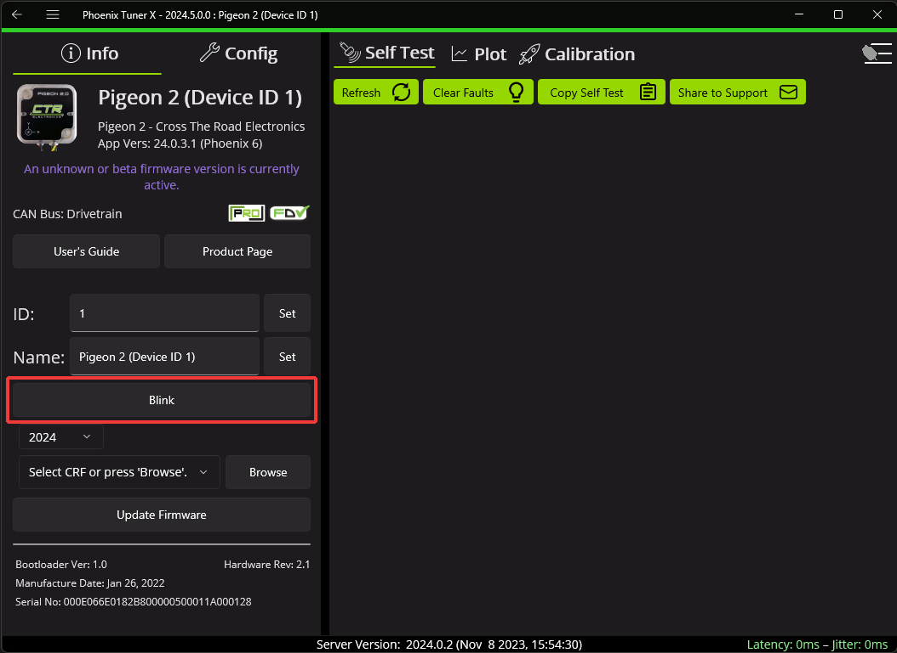

 1. go to [SuperConstants](src\main\java\frc\robot\subsystems\superstructure\SuperConstants.java) and look at the CANid constant. What you will have to do is open Tuner X on Laptop E. From there you will connect to the robot via a tether
and make sure the robot is turned on
    - Verify that all motors bring up an orange LED status, if there is ANY red on the status lights there is a problem with the CANbus
Now you will go onto Tuner X and search for the motors that have duplicates or have outdated firmware.
    - For duplicate CANids what you want to do is click on the widget that says "There are 2 devices sharing the same CANid" and change the ID to a number thats unused 
    (something like 60)
    - For outdated firmware click on the widget that you want to upgrade and click the Arrow that points up
    
# Make sure the CANids, ALL match the motors on the robot, verify each motor by blinking their LEDs

2